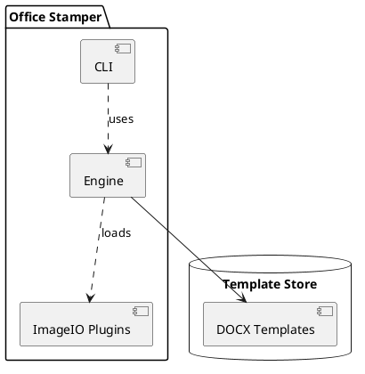
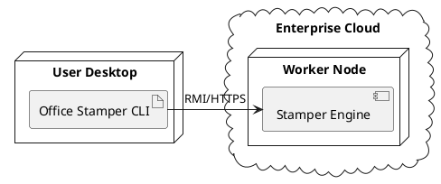

As a software craftsman, I've seen countless architectures fail not because of
bad code but because of poor visibility. We often focus so much on the "how"
(the implementation) that we lose sight of the "where" and "what" (the structure
and distribution).

In this post, we'll dive into two essential tools in the PlantUML arsenal:
**Component Diagrams** and **Deployment Diagrams**.

## Why Component Diagrams?

When your system grows beyond a few classes, you need a higher-level
abstraction. Component diagrams allow you to model the logical parts of your
system and their interfaces.

[Component Diagram syntax](https://plantuml.com/fr/component-diagram) is
straightforward:

### Driving Dev Team Adhesion
I use component diagrams during "Town Hall" dev meetings. Instead of showing code, I show these boundaries. It helps new joiners understand the ownership of different modules and why we don't allow circular dependencies between, say, the `CLI` and the `Engine`. When everyone sees the same map, the team adheres much better to the architectural vision.

## Mapping to Reality: Deployment Diagrams

A great architecture on paper is useless if the deployment is a
mystery. [Deployment Diagrams](https://plantuml.com/fr/deployment-diagram) show
how your software artifacts are mapped to hardware or execution environments.

### Brainstorming with Architects
During real-time brainstorming sessions between architects, I often share my screen with a PlantUML file open. As we debate whether a service should be on-prem or in the cloud, I update the deployment diagram live. It's much faster than dragging icons in a heavy tool and ensures that by the end of the meeting, the "minutes" are actually a versionable diagram.

## Conclusion

Diagrams-as-code ensure that your documentation lives and breathes with your
code. No more outdated Visio files or lost Draw.io links.

Stay tuned for the next post where we'll explore rapid GUI prototyping with
Salt!
