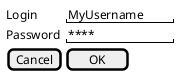
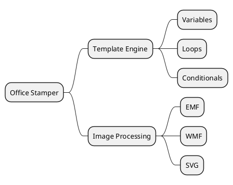

Before writing a single line of Java or HTML, I like to "sketch" the problem
space and the potential solution. But as a tech lead who values version control
and plain text, traditional UX tools often feel too heavy.

Enter **Salt** and **MindMaps** — two PlantUML features that turn text into
visual ideas.

## Rapid GUI Mockups with Salt

[Salt](https://plantuml.com/fr/salt) is a sub-language within PlantUML designed
for wireframing. It is not about pixel-perfect design; it is about functionality
and flow.

### Driving Discussions with Business Analysts
Salt is my favorite tool for bridge-building with BAs. When a BA describes a new feature, I don't write a 10-page spec. I type a Salt mockup. If they say, "No, the 'OK' button should be on the left," I move it in 2 seconds. This real-time iteration builds trust and ensures we're building exactly what the business needs.

## MindMaps for Brainstorming

When I'm starting a new module for `office-stamper`, I often start with
a [MindMap](https://plantuml.com/fr/mindmap-diagram) to map out requirements and
edge cases.

### Real-time Architecture Brainstorming
During brainstorming sessions, MindMaps allow us to branch out ideas without getting bogged down in structure. As architects, we can capture the complexity of a system transition or a new feature set in real-time. The text-based nature means we can later "copy-paste" these ideas directly into our technical tasks or epic descriptions.

## Bridging the Gap

By using MindMaps to explore the "What" and Salt to explore the "How", we
maintain a consistent toolchain from ideation to deployment.

In our next article, we'll see how to visualize the data that powers these
systems using JSON, YAML, and Regex diagrams!
