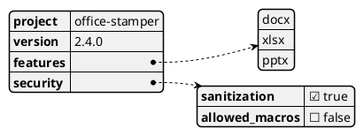
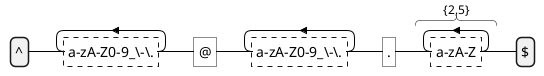

In the world of Enterprise Document Automation, data is king. Whether it's the
configuration for a pipeline or the JSON payload sent to an LLM, understanding
the shape of your data is critical for security and compliance.

## JSON and YAML Visualization

[PlantUML's JSON](https://plantuml.com/fr/json)
and [YAML](https://plantuml.com/fr/yaml) support is a hidden gem. It allows you
to turn raw data into a readable tree structure.

### Example: Office-Stamper Configuration

### Application State to Visual Image: The Power of Automation
One of the most powerful use cases for diagrams-as-code is turning a complex application state into a usable image. Since it is trivial to ask software to output text in a specific format, we can build "debug endpoints" that return JSON or YAML in a PlantUML-compatible format. Instead of parsing 1000 lines of log files, a developer can simply hit an endpoint and see a visual representation of the current system configuration or a user's session state.

## Demystifying Regular Expressions

We've all been there: staring at a complex Regex string, trying to figure out
what it actually matches. PlantUML
can [visualize Regular Expressions](https://plantuml.com/fr/regex), turning a
cryptic string into a clear state machine.

## The CISO Perspective

From a security standpoint, being able to visualize your data schemas and
validation logic (Regex) is a powerful auditing tool. It ensures that everyone —
from the developer to the security auditor — has the same understanding of what
data is allowed into the system.

Next, we'll look at how to manage the projects that handle this data using Gantt
and WBS diagrams!
