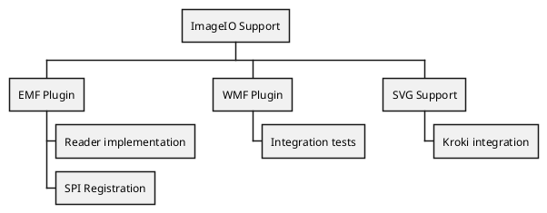
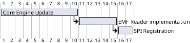

As a tech lead, I often find myself caught between the world of code, and the
world of project management. Traditional PM tools often feel disconnected from
the daily reality of development.

This is where [Gantt Diagrams](https://plantuml.com/fr/gantt-diagram)
and [Work Breakdown Structures (WBS)](https://plantuml.com/fr/wbs-diagram) as
code become invaluable.

## Work Breakdown Structure (WBS)

Before jumping into a timeline, I use a WBS to break down the work for a new
release of my `imageio` plugins.

## Gantt Charts as Code

Once the tasks are defined, I can map them out in
a [Gantt Chart](https://plantuml.com/fr/gantt-diagram).

### Driving Team Alignment
I use these Gantt charts during our weekly syncs to drive adhesion inside the dev team. When developers see their tasks mapped out relative to the core engine updates, the dependencies become "real." It's no longer a manager telling them to hurry; it's a visual constraint that we all agreed upon in the code.

## Chronology Diagrams

For fine-grained timing, especially in systems integration, [Chronology Diagrams](https://plantuml.com/fr/chronology-diagram) help visualize the exact sequence of events over time. This is particularly useful for driving discussions with stakeholders who need to understand the performance impact of each step in a document generation pipeline.

## Why This Matters

By keeping our project plans in Git:

1. **Transparency**: The team can see the plan in the same place they see the
   code.
2. **History**: We can see how the plan evolved alongside the implementation.
3. **Simplicity**: No expensive licenses or complex UI to navigate.

In the next post, we'll dive into the logic of our systems with State and
Activity diagrams!
