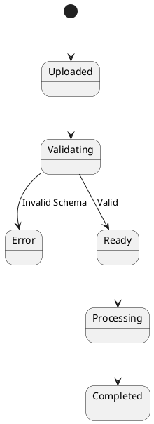
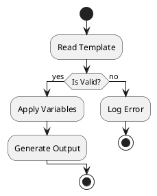

Code is essentially a collection of states and transitions. When these become
complex, simply reading the code isn't enough to understand the "big picture".

## State Diagrams for Robust Systems

[State Diagrams](https://plantuml.com/fr/state-diagram) are essential for
modeling life cycles. For example, a document in the `office-stamper` pipeline:

### BA/Dev Collaboration on Complex Workflows
State diagrams are the "lingua franca" between BAs and developers. When I'm implementing a new lifecycle for a document, I share this diagram with the BA. It allows us to discuss edge cases—like "what happens if the validation fails?"—before we've invested hours in the code.

## Activity Diagrams (Beta)

For modeling business processes or algorithm flow,
the [new Activity Diagrams (Beta)](https://plantuml.com/fr/activity-diagram-beta)
offer a much cleaner syntax.

### Real-time Brainstorming for Logic
During architectural brainstorming sessions, Activity diagrams help us trace the "happy path" and the error paths of a new algorithm. Because the syntax is so lightweight, we can draw and refine the logic in real-time as we talk. By the time we leave the room, the diagram is already 90% of our implementation plan.

## Craftsmanship and Logic

A well-crafted system has clear boundaries and predictable logic. Visualizing
this logic with diagrams-as-code ensures that your intent is clear, and your
implementation is verifiable.

In our final post of this series, we'll return to the basics of structural
modeling with Class and Object diagrams!
