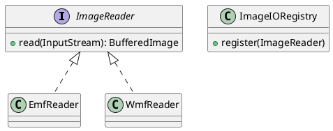

To conclude our series on diagrams-as-code, we return to the bedrock of software
modeling: structural diagrams.

## Class Diagrams: The Blueprint

[Class Diagrams](https://plantuml.com/fr/class-diagram) are the most common use
case for PlantUML. They define the static structure of your system.

### Driving DDD Discussions
Class diagrams are essential for Domain-Driven Design (DDD) discussions. When defining our bounded contexts and entities, we use these diagrams to ensure everyone has the same mental model of the domain. It's a tool for adhesion across the entire engineering organization.

## Object Diagrams: The Snapshot

While class diagrams show the "what can be",
[Object Diagrams](https://plantuml.com/fr/object-diagram) show the "what
is". They are snapshots of your system at a specific point in time, which is
incredibly useful for debugging complex object graphs.

### Debugging with Snapshots
Object diagrams are the ultimate tool for turning a complex application state into a usable image. When I'm debugging a strange issue in the `IIORegistry`, I often write a small helper method to output the current registry state in PlantUML format. Seeing the actual instances and their connections is infinitely better than reading a stack trace.

## Archimate for Enterprise Strategy

For those working at a larger scale, PlantUML also
supports [Archimate](https://plantuml.com/fr/archimate-diagram), the open
standard for enterprise architecture. This allows you to link your technical
implementation to business goals and strategic capabilities.

## The Final Word on Diagrams-as-Code

Throughout this series, we've seen how tools like PlantUML (
and [Mermaid](https://mermaid.js.org/), for simpler needs) allow us to treat
documentation with the same rigor as our code.

By keeping our diagrams in plain text:

- They are **versioned** alongside the code.
- They are **reviewable** in PRs.
- They are **reproducible** across the team.

This is the essence of craftsmanship: caring for every artifact of the software
development lifecycle.

Happy modeling!
